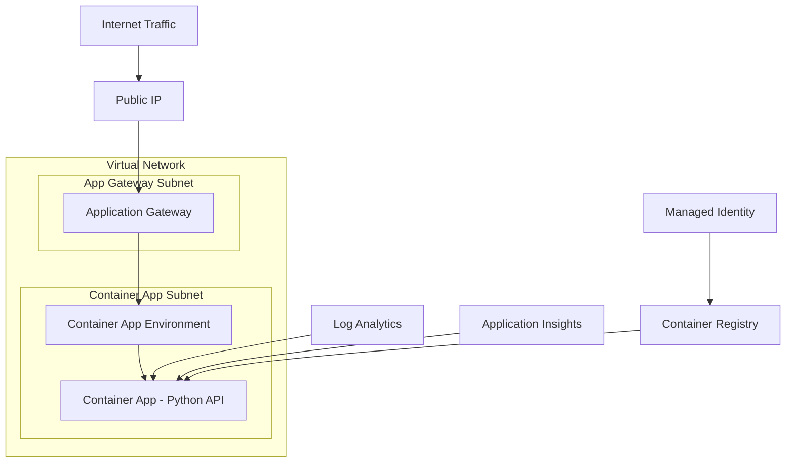

# Container App with Application Gateway Demo

This project demonstrates how an Azure Application Gateway can serve incoming requests to a backend Container App with Workload Profiles (v2) running a Python microservice.

## Architecture

- **Azure Application Gateway**: Frontend load balancer with public IP endpoint
- **Azure Container App**: Workload Profiles v2 (dedicated compute) hosting Python Flask API
- **Virtual Network**: Proper subnet segmentation with security groups
- **Supporting Services**: Container Registry, Log Analytics, Application Insights

## Prerequisites

- [Azure Developer CLI (azd)](https://learn.microsoft.com/azure/developer/azure-developer-cli/)
- [Azure CLI](https://docs.microsoft.com/cli/azure/install-azure-cli)
- [Docker](https://www.docker.com/get-started) (for building container images)

## Quick Start

1. **Clone and navigate to the project:**
   ```bash
   # If you haven't already, navigate to the project directory
   cd ContainerAppWithAppGW
   ```

2. **Initialize the environment:**
   ```bash
   azd auth login
   azd env new
   ```

3. **Deploy the infrastructure and application:**
   ```bash
   azd up
   ```

4. **Access the application:**
   - The deployment will output the Application Gateway public IP
   - Access your application at: `http://<APPLICATION_GATEWAY_PUBLIC_IP>`

## API Endpoints

The Python Flask microservice provides several endpoints:

- `GET /` - Home page with service information
- `GET /health` - Health check endpoint (used by Application Gateway probe)
- `GET /api/info` - API information and available endpoints
- `GET /api/data` - Sample data endpoint

## Project Structure

```
├── azure.yaml                     # Azure Developer CLI configuration
├── Dockerfile                     # Container image definition
├── src/
│   ├── app.py                     # Python Flask microservice
│   └── requirements.txt           # Python dependencies
├── infra/                         # Infrastructure as Code (Bicep)
│   ├── main.bicep                 # Main deployment template
│   ├── main.parameters.json       # Deployment parameters
│   ├── resources.bicep            # Azure resources definition
│   └── modules/
│       ├── network.bicep          # Virtual network and security groups
│       ├── containerapp.bicep     # Container App Environment and App
│       └── appgateway.bicep       # Application Gateway configuration
└── .azure/
    └── plan.copilotmd             # Deployment plan documentation
```

## Key Features

### Container App Configuration
- **Workload Profiles v2**: Uses dedicated compute (GeneralPurpose D4)
- **Auto-scaling**: 1-5 replicas based on HTTP request load
- **Health Probes**: Liveness and readiness probes on `/health` endpoint
- **Managed Identity**: Secure access to Container Registry without passwords

### Application Gateway Configuration
- **Public Endpoint**: Internet-facing load balancer
- **Health Monitoring**: Continuous health checks on backend Container App
- **Load Balancing**: Distributes traffic to Container App instances
- **Network Integration**: Secure communication within VNet

### Security Features
- **Managed Identity**: No hardcoded credentials
- **Network Segmentation**: Separate subnets for App Gateway and Container Apps
- **Security Groups**: Controlled network access between components
- **HTTPS Backend**: Encrypted communication to Container App

## Monitoring and Logging

- **Application Insights**: Application performance monitoring and telemetry
- **Log Analytics**: Centralized logging for all components
- **Health Probes**: Application Gateway monitors backend health

## Customization

### Environment Variables
Configure these in your azd environment or through the Azure portal:

- `AZURE_ENV_NAME`: Environment name (default: dev)
- `AZURE_LOCATION`: Azure region (default: eastus)

### Scaling Configuration
Modify the auto-scaling rules in `infra/modules/containerapp.bicep`:

```bicep
scale: {
  minReplicas: 1
  maxReplicas: 5
  rules: [
    {
      name: 'http-scaler'
      http: {
        metadata: {
          concurrentRequests: '50'
        }
      }
    }
  ]
}
```

## Troubleshooting

### Check deployment logs:
```bash
azd logs
```

### View Container App logs:
```bash
az containerapp logs show --name <container-app-name> --resource-group <resource-group-name>
```

### Check Application Gateway backend health:
```bash
az network application-gateway show-backend-health --name <app-gateway-name> --resource-group <resource-group-name>
```

## Clean Up

To remove all resources:
```bash
azd down
```

## Architecture Diagram



## Next Steps

- Add custom domain and SSL certificate to Application Gateway
- Implement authentication and authorization
- Add database integration
- Set up CI/CD pipeline
- Configure custom scaling rules
- Add monitoring alerts