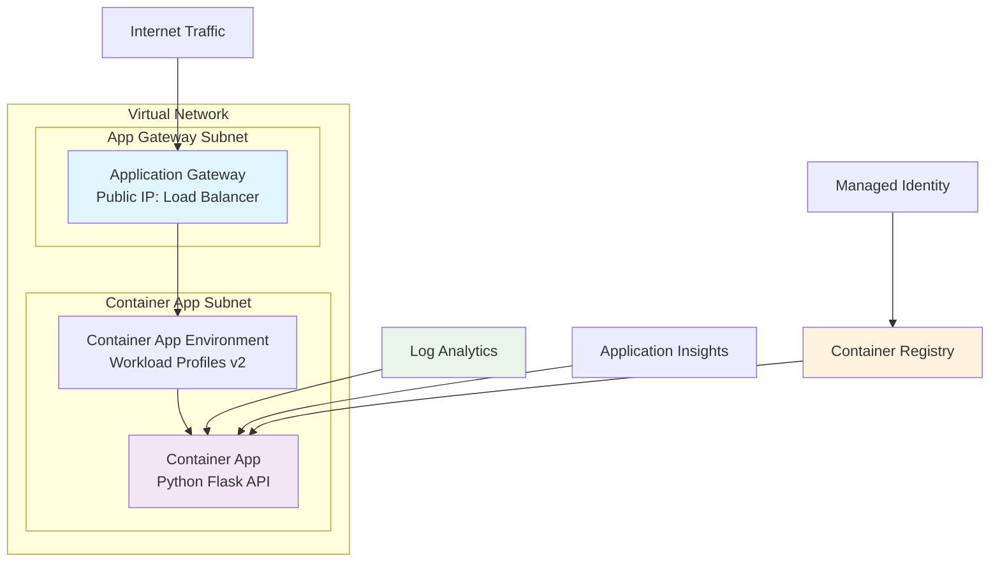

# Azure Container App with Application Ga[](https://portal.azure.com/#create/Microsoft.Template/uri/https%3A%2F%2Fraw.githubusercontent.com%2Fmasile27%2Fcontainerapp-appgw-demo%2Fmain%2Fazuredeploy.json)eway Demo


A complete demonstration of how Azure Application Gateway can route traffic to Azure Container Apps with Workload Profiles v2, showcasing enterprise-grade architecture patterns for serverless containerized applications.

## 🏗️ Architecture Overview



## 🚀 Quick Deploy Options

### 🎯 Option 1: One-Click Deploy
[](https://portal.azure.com/#create/Microsoft.Template/uri/https%3A%2F%2Fraw.githubusercontent.com%2F[YOUR-USERNAME]%2Fcontainerapp-appgw-demo%2Fmain%2Fazuredeploy.json)

### 🔧 Option 2: Azure Developer CLI
```bash
git clone https://github.com/[YOUR-USERNAME]/containerapp-appgw-demo.git
cd containerapp-appgw-demo
azd auth login
azd up
```

### ⚡ Option 3: Azure CLI
```bash
git clone https://github.com/[YOUR-USERNAME]/containerapp-appgw-demo.git
cd containerapp-appgw-demo
az group create --name rg-containerapp-appgw-demo --location eastus
az deployment group create --resource-group rg-containerapp-appgw-demo --template-file azuredeploy.json
```

## 🧪 Testing Your Deployment

Once deployed, test the complete flow:

```bash
# Get your Application Gateway public IP from deployment outputs
APP_GW_IP="<YOUR-APP-GATEWAY-IP>"

# Test all endpoints through Application Gateway
curl http://$APP_GW_IP/                    # Home page
curl http://$APP_GW_IP/health              # Health check  
curl http://$APP_GW_IP/api/info            # API documentation
curl http://$APP_GW_IP/api/data            # Sample data
```

### Expected Response:
```json
{
  "message": "Hello from Container App with Application Gateway!",
  "service": "Python Flask API",
  "hostname": "api-xxxxxxxx-xxxxxxxxxxxxx-xxxxx",
  "timestamp": "2025-10-03T22:27:09.457684",
  "version": "1.0.0"
}
```

## 🔧 Key Features

| Feature | Description | Benefit |
|---------|-------------|---------|
| **Workload Profiles v2** | Dedicated compute for Container Apps | Predictable performance & scaling |
| **Application Gateway** | Layer 7 load balancer with WAF capability | Enterprise security & routing |
| **Auto-scaling** | HTTP-based scaling (1-5 replicas) | Cost optimization & performance |
| **Health Monitoring** | Automated health probes | High availability |
| **Managed Identity** | Secure access without credentials | Zero-trust security |
| **Network Isolation** | VNet integration with NSGs | Enhanced security |

## 📁 Repository Structure

```
containerapp-appgw-demo/
├── 📄 azuredeploy.json              # ARM template for Deploy to Azure
├── 📄 azuredeploy.parameters.json   # Default deployment parameters  
├── 📄 azure.yaml                    # Azure Developer CLI config
├── 📄 Dockerfile                    # Container image definition
├── 📁 src/
│   ├── 📄 app.py                    # Python Flask microservice
│   └── 📄 requirements.txt          # Python dependencies
├── 📁 infra/
│   ├── 📄 main.bicep                # Main Infrastructure as Code
│   ├── 📄 main.parameters.json      # Bicep parameters
│   ├── 📄 resources.bicep           # Azure resources
│   └── 📁 modules/
│       ├── 📄 network.bicep         # VNet & security groups
│       ├── 📄 containerapp.bicep    # Container Apps config
│       └── 📄 appgateway.bicep      # Application Gateway setup
├── 📄 README.md                     # This documentation
└── 📄 LICENSE                       # MIT License
```

## 🔍 API Documentation

| Endpoint | Method | Description | Response |
|----------|--------|-------------|----------|
| `/` | GET | Service information | JSON with hostname, timestamp |
| `/health` | GET | Health check for probes | `{"status": "healthy"}` |
| `/api/info` | GET | API documentation | Available endpoints list |
| `/api/data` | GET | Sample dataset | Demo data with metadata |

## 📊 Infrastructure Components

### Core Resources Created:
- **Resource Group**: `rg-containerapp-appgw-demo`
- **Application Gateway**: Public load balancer with health probes
- **Container App Environment**: Workload Profiles v2 with dedicated compute
- **Container App**: Auto-scaling Python Flask API
- **Virtual Network**: Segmented subnets with security groups
- **Container Registry**: Private registry for application images
- **Log Analytics Workspace**: Centralized logging
- **Application Insights**: APM and telemetry

### Networking:
- **VNet Address Space**: `10.0.0.0/16`
- **App Gateway Subnet**: `10.0.1.0/24`
- **Container App Subnet**: `10.0.2.0/23` (delegated)
- **NSG Rules**: Secure traffic flow between tiers

## 🛠️ Customization

### Scaling Configuration
Edit `infra/modules/containerapp.bicep`:

```bicep
scale: {
  minReplicas: 1
  maxReplicas: 10        // Increase max replicas
  rules: [
    {
      name: 'http-scaler'
      http: {
        metadata: {
          concurrentRequests: '30'  // Lower threshold for faster scaling
        }
      }
    }
  ]
}
```

### Application Gateway Settings
Edit `infra/modules/appgateway.bicep` for custom routing, SSL, or WAF rules.

### Container App Configuration
Modify environment variables, resource allocation, or probes in the container app module.

## 📈 Monitoring & Troubleshooting

### View Logs:
```bash
# Container App logs
az containerapp logs show --name <app-name> --resource-group <rg-name>

# Application Gateway metrics
az monitor metrics list --resource <app-gateway-resource-id> --metric RequestCount
```

### Health Checks:
```bash
# Backend health
az network application-gateway show-backend-health --name <app-gw-name> --resource-group <rg-name>
```

### Common Issues:
1. **503 Errors**: Check container app health and scaling settings
2. **Gateway Timeouts**: Verify backend connectivity and NSG rules  
3. **Image Pull Errors**: Ensure container registry access and managed identity

## 🧹 Cleanup

```bash
# Using azd
azd down

# Using Azure CLI  
az group delete --name rg-containerapp-appgw-demo --yes --no-wait
```

## 🤝 Contributing

1. Fork the repository
2. Create a feature branch (`git checkout -b feature/amazing-feature`)
3. Commit changes (`git commit -m 'Add amazing feature'`)
4. Push to branch (`git push origin feature/amazing-feature`)
5. Open a Pull Request

## 📋 Prerequisites

- Azure subscription
- Azure CLI or Azure Developer CLI
- Docker (for local development)
- Git

## 🏷️ Tags

`azure` `container-apps` `application-gateway` `python` `flask` `bicep` `infrastructure-as-code` `workload-profiles` `microservices` `serverless` `load-balancer` `enterprise-architecture`

---

**⭐ If this project helped you, please give it a star!**